# Git Assignment 01: Scribe Sheet

**Student Name**: Prithu Anan  
**Student ID**: ICDB3_203

---

## Git Commands Scribe Sheet

This document provides an overview of essential Git commands with descriptions, examples, and screenshots. Screenshots are stored in the `screenshots` folder, and each command includes an illustration of usage on a local repository.

### Table of Contents

1. [Git Basics](#git-basics)
2. [Branching and Merging](#branching-and-merging)
3. [Working with Remotes](#working-with-remotes)
4. [Stashing and Cleaning](#stashing-and-cleaning)
5. [Advanced Commands](#advanced-commands)

---

### 1. Git Basics

#### `git init`

- **Description**: Initializes a new Git repository in the current directory.
- **Usage**:
  ```bash
  git init
  ```
- **Explanation**: Creates a `.git` folder, setting up a new repository for tracking files.
- **Screenshot**: 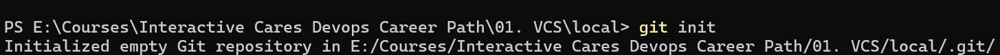

#### `git clone`

- **Description**: Clones a repository from a remote source to your local machine.
- **Usage**:
  ```bash
  git clone <repository-url>
  ```
- **Explanation**: Creates a copy of a repository on your system, including the full history.
- **Screenshot**: 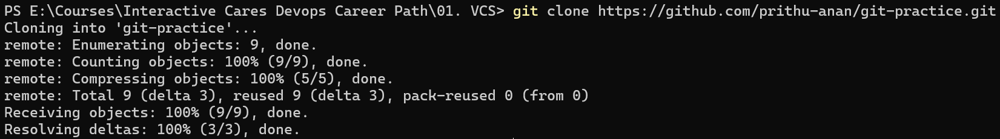

#### `git add`

- **Description**: Stages changes to be committed.
- **Usage**:
  ```bash
  git add <file_name>
  git add .
  ```
- **Explanation**: Adds specific files or all files (using `.`) to the staging area, preparing them for a commit.
- **Screenshot**: 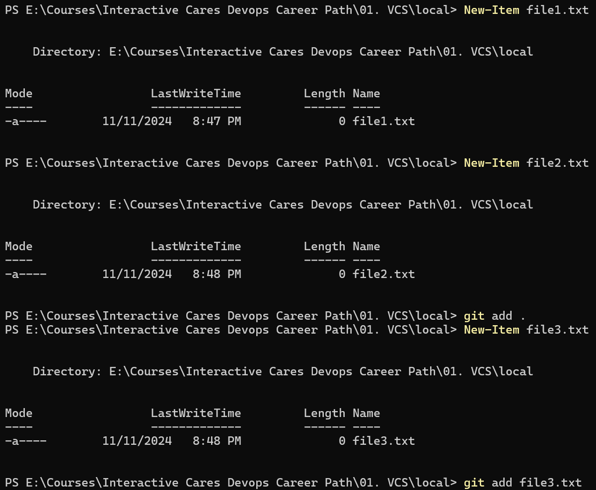

#### `git commit`

- **Description**: Commits staged changes to the repository with a descriptive message.
- **Usage**:
  ```bash
  git commit -m "Commit message"
  ```
- **Explanation**: Commits are snapshots of your project at specific points in time, and each commit requires a message describing the changes.
- **Screenshot**: 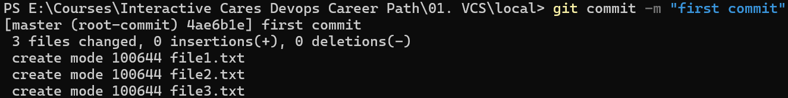

---

### 2. Branching and Merging

#### `git branch`

- **Description**: Lists branches or creates a new branch.
- **Usage**:
  ```bash
  git branch         # List all branches
  git branch <branch_name>  # Create a new branch
  ```
- **Explanation**: Branches allow parallel development by separating out a copy of the code.
- **Screenshot**: 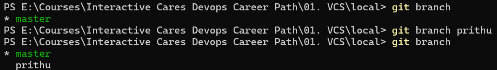

#### `git checkout`

- **Description**: Switches to the specified branch.
- **Usage**:
  ```bash
  git checkout <branch_name>
  ```
- **Explanation**: Changes the current branch, allowing you to work on different versions of the code.
- **Screenshot**: 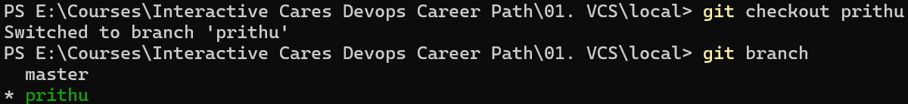

#### `git merge`

- **Description**: Merges the specified branch into the current branch.
- **Usage**:
  ```bash
  git merge <branch_name>
  ```
- **Explanation**: Combines changes from different branches.
- **Screenshot**: 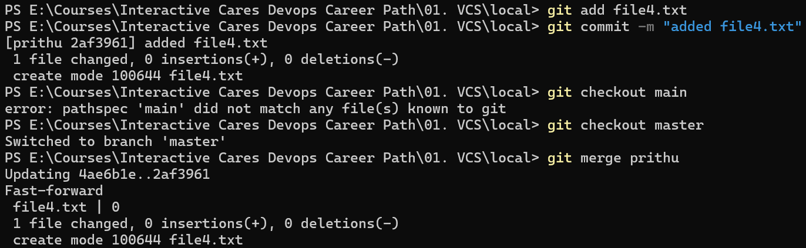

---

### 3. Working with Remotes

#### `git remote`

- **Description**: Manages remote connections.
- **Usage**:
  ```bash
  git remote add <name> <url>
  ```
- **Explanation**: Adds a remote repository for collaboration.
- **Screenshot**: 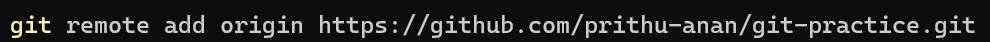

#### `git push`

- **Description**: Pushes committed changes to a remote repository.
- **Usage**:
  ```bash
  git push origin <branch_name>
  ```
- **Explanation**: Sends your changes to a remote repository.
- **Screenshot**: 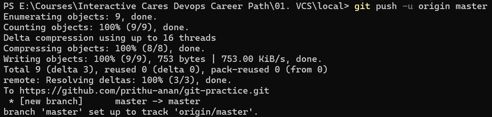

#### `git pull`

- **Description**: Fetches and integrates changes from a remote repository.
- **Usage**:
  ```bash
  git pull origin <branch_name>
  ```
- **Explanation**: Combines changes from the remote branch into your local branch.
- **Screenshot**: 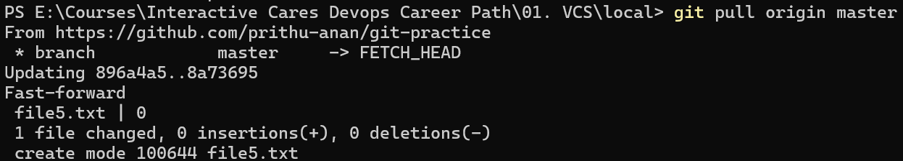

---

### 4. Stashing and Cleaning

#### `git stash`

- **Description**: Temporarily saves changes without committing them.
- **Usage**:
  ```bash
  git stash
  ```
- **Explanation**: Stores your changes to return to a clean working state.
- **Screenshot**: 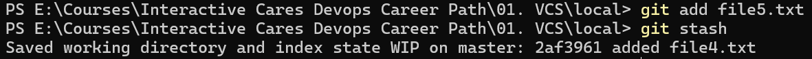

#### `git stash pop`

- **Description**: Applies the most recent stashed changes and removes it from the stash list.
- **Usage**:
  ```bash
  git stash pop
  ```
- **Explanation**: When you use `git stash` to temporarily save changes, `git stash pop` restores these changes to your working directory and removes them from the stash. This is useful when you want to apply stashed changes but no longer need to keep them in the stash list.

  > **Note**: If you want to apply the changes without removing them from the stash list, you can use `git stash apply` instead.

- **Screenshot**: 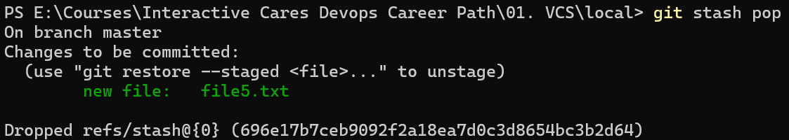

---

### 5. Advanced Commands

#### `git rebase`

- **Description**: Applies commits from one branch onto another base.
- **Usage**:
  ```bash
  git rebase <branch_name>
  ```
- **Explanation**: Rewrites commit history by moving or combining commits.
- **Screenshot**: 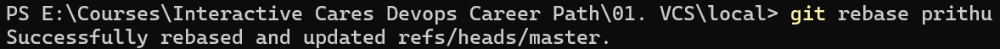

#### `git log`

- **Description**: Displays the commit history for the repository, listing details about each commit.
- **Usage**:
  ```bash
  git log
  ```
- **Explanation**: This command shows a detailed history of commits, including commit hashes, author information, dates, and commit messages. It's useful for tracking changes over time and identifying specific commits.
  
  **Variations**:
  - `git log --oneline`: Displays a condensed version, showing each commit on a single line.
  - `git log --graph`: Shows a visual representation of the branch and merge structure.

- **Screenshot**: 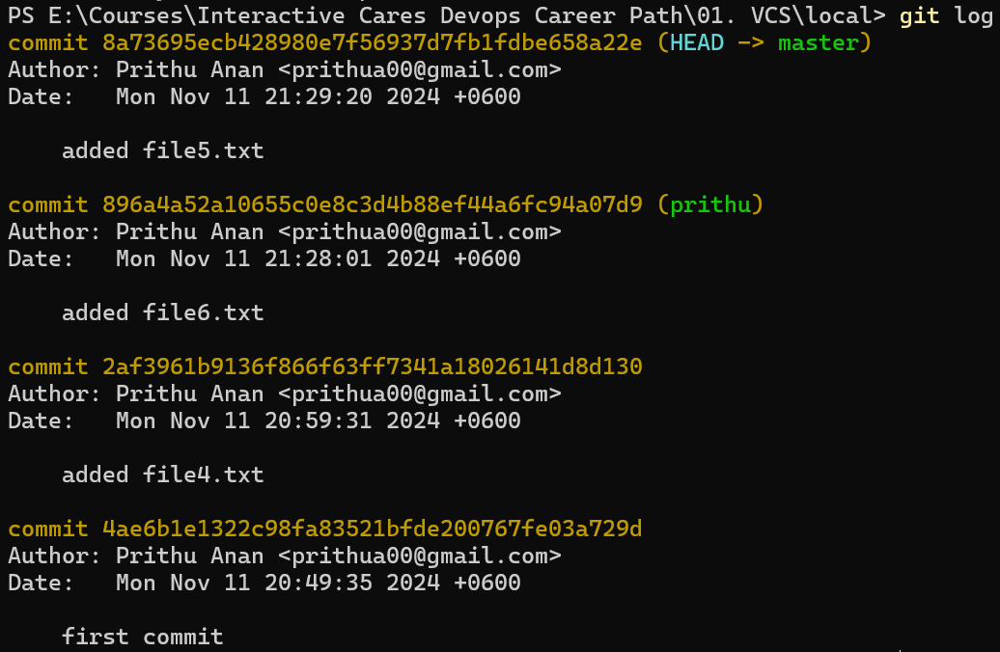

---